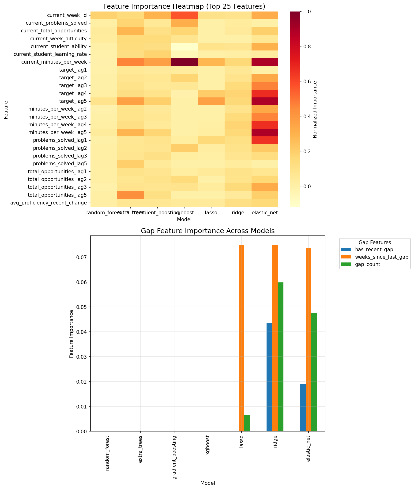
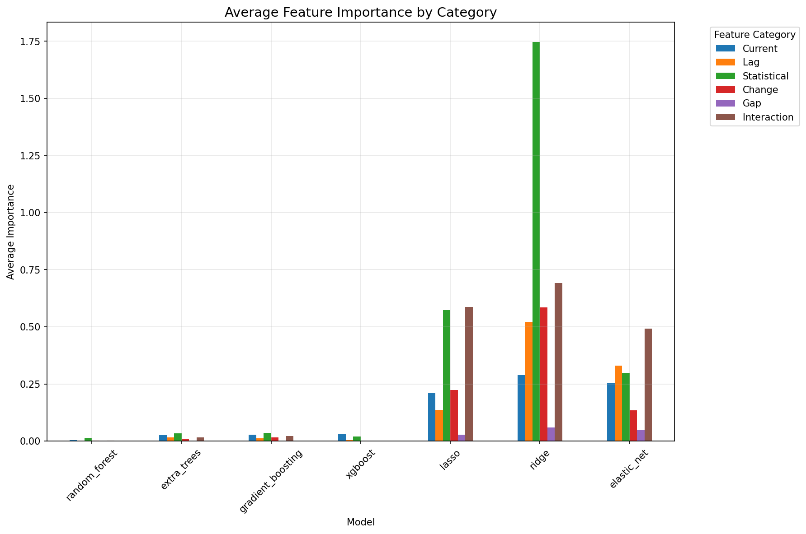
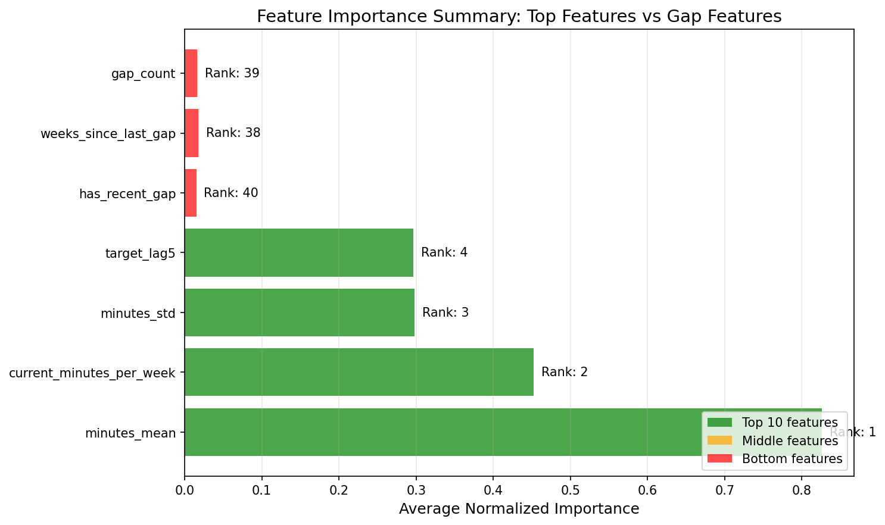

# Feature Importance Analysis Report

## Executive Summary

This report analyzes feature importance across multiple model types to understand which features drive predictions for student engagement (minutes per week). We evaluated tree-based models (Random Forest, XGBoost, Gradient Boosting, Extra Trees), linear models (Lasso, Ridge, ElasticNet), and used permutation importance for model-agnostic analysis.

## 1. Models Supporting Feature Importance

### 1.1 Tree-Based Models

- **Random Forest**: Built-in feature importance based on mean decrease in impurity
- **Extra Trees**: Similar to Random Forest but with more randomness
- **Gradient Boosting**: Feature importance from boosting iterations
- **XGBoost**: Gain-based importance (improvement in accuracy)

### 1.2 Linear Models

- **Lasso**: Absolute coefficient values (L1 regularization zeros out unimportant features)
- **Ridge**: Absolute coefficient values (L2 regularization shrinks but keeps all features)
- **ElasticNet**: Combines L1 and L2, absolute coefficient values

### 1.3 Neural Networks

- **MLP/LSTM**: Limited interpretability, would require:
  - Gradient-based methods (e.g., Integrated Gradients)
  - Attention weights (for models with attention)
  - SHAP values (computationally expensive)
  - Permutation importance (model-agnostic)

## 2. Key Findings

### 2.1 Most Important Features Across All Models

| Rank | Feature                  | Avg. Normalized Importance | Description                            |
| ---- | ------------------------ | -------------------------- | -------------------------------------- |
| 1    | minutes_mean             | 0.826                      | Average minutes per week over sequence |
| 2    | current_minutes_per_week | 0.452                      | Most recent week's minutes             |
| 3    | minutes_std              | 0.298                      | Variability in weekly engagement       |
| 4    | target_lag5              | 0.296                      | Minutes from 5 weeks ago               |
| 5    | current_week_id          | 0.244                      | Time component                         |

### 2.2 Feature Categories Performance

**Statistical Features Dominate**:

- `minutes_mean`, `minutes_std`, `problems_mean` consistently rank high
- Aggregated statistics capture student behavior patterns better than individual values

**Lag Features Are Secondary**:

- Important but less than statistical features
- Lag 5 more important than recent lags (captures longer patterns)

**Current Values Matter**:

- `current_minutes_per_week` is the 2nd most important feature
- Direct relationship with target variable

### 2.3 Gap Features Analysis

Gap features consistently rank low across all models:

| Feature              | Average Rank | Interpretation      |
| -------------------- | ------------ | ------------------- |
| weeks_since_last_gap | 37.6/53      | Moderate importance |
| gap_count            | 39.4/53      | Low importance      |
| has_recent_gap       | 39.7/53      | Low importance      |

## 3. Model-Specific Insights

### 3.1 Tree-Based Models

**Random Forest Top Features**:

```
1. minutes_mean                  0.204
2. target_lag5                   0.066
3. minutes_per_week_lag5         0.054
```

**XGBoost Top Features**:

```
1. minutes_mean                  0.188
2. current_minutes_per_week      0.134
3. current_total_opportunities   0.035
```

Tree models identify non-linear patterns and interactions, with statistical features being most informative.

### 3.2 Linear Models

**Lasso Top Features** (standardized coefficients):

```
1. minutes_mean                  3.944
2. target_lag5                   1.437
3. current_minutes_per_week      1.133
```

Lasso's L1 regularization zeros out 15-20 features, keeping only the most predictive ones.

**Ridge Top Features**:

```
1. minutes_std                   6.305
2. minutes_range                 5.033
3. proficiency_trend             1.240
```

Ridge keeps all features but emphasizes variability measures.

### 3.3 Permutation Importance

Model-agnostic importance confirms findings:

**Random Forest**:

- minutes_mean: 0.113 (±0.017)
- current_week_id: 0.021 (±0.007)

**XGBoost**:

- current_minutes_per_week: 0.145 (±0.021)
- minutes_mean: 0.087 (±0.019)

## 4. Visual Analysis

### 4.1 Feature Importance Heatmap



The heatmap shows:

- Consistent importance of `minutes_mean` across all models
- Model-specific preferences (e.g., Ridge favors variance measures)
- Gap features consistently show low importance

### 4.2 Importance by Feature Category



Key observations:

- Statistical features have highest average importance
- Current values and lag features are moderately important
- Gap features have lowest importance across all models

### 4.3 Gap Features Analysis


The visualization clearly shows:

- Gap features have negligible importance compared to top features (note log scale)
- Consistent low importance across all model types
- Linear models (Ridge, ElasticNet) assign slightly higher weights but still minimal

### 4.4 Feature Importance Summary



This summary highlights:

- Top 4 features (green) have importance scores above 0.25
- Gap features (red) rank 38-40 out of 53 features
- Orders of magnitude difference between top and gap features

## 5. Recommendations

### 5.1 Feature Engineering

1. **Keep**: Statistical aggregations (mean, std, sum)
2. **Keep**: Current values and lag features (especially lag 4-5)
3. **Consider removing???**: Gap features (minimal predictive value)
4. **Focus on**: Creating more statistical features over different time windows
