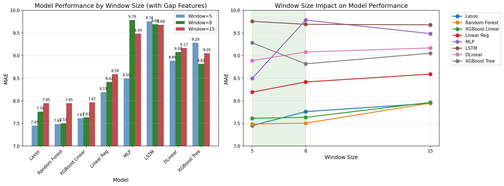
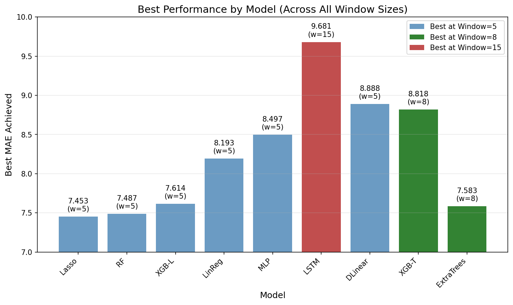

# Performance Analysis Report: Gap Features and Window Size Impact

## Executive Summary

This report analyzes the impact of gap features and sequence window size on time-series prediction models for student engagement (minutes per week). We conducted experiments with window sizes of 5, 8, and 15 timesteps, evaluating multiple model architectures

## 1. Experimental Setup

### 1.1 Dataset

- **Source**: `student_week_aggregations_rolling_new.csv`
- **Total records**: 3,524 weekly observations
- **Students**: 127 unique students
- **Time span**: 39 weeks (2010-W43 to 2012-W22)
- **Target variable**: `minutes_per_week` (weekly time spent)

### 1.2 Feature Engineering Pipeline

feature engineering creates a set of 53-103 features (depending on window size):

#### Base Features (9 features)

```
- week_id
- minutes_per_week (target)
- problems_solved
- total_opportunities
- avg_proficiency
- n_skills_measured
- week_difficulty
- student_ability
- student_learning_rate
```

#### Engineered Features

1. **Current Values** (9 features): All base features from the most recent timestep
2. **Lag Features** (25-75 features depending on window):

   - `avg_proficiency`: 5, 8, or 15 lags
   - `minutes_per_week`: 5, 8, or 15 lags
   - `problems_solved`: 5, 8, or 15 lags
   - `total_opportunities`: 5, 8, or 15 lags
   - `n_skills_measured`: 5, 8, or 15 lags

3. **Change/Momentum Features** (6 features):

   - `avg_proficiency_recent_change`: Last value - previous value
   - `avg_proficiency_avg_change`: Average change over sequence
   - `minutes_per_week_recent_change`
   - `minutes_per_week_avg_change`
   - `problems_solved_recent_change`
   - `problems_solved_avg_change`

4. **Statistical Features** (9 features):

   - Minutes per week: mean, std, range, IQR
   - Problems solved: mean, sum, std
   - Proficiency: trend (linear fit slope), acceleration

5. **Interaction Features** (1 feature):

   - `minutes_x_difficulty`: minutes_per_week × week_difficulty

6. **Gap Features** (3 features):

   - `has_recent_gap`: Binary indicator if gap in last 3 weeks
   - `weeks_since_last_gap`: Number of weeks since last gap (0 minutes)
   - `gap_count`: Total number of gaps in sequence

### 1.3 Model Configurations

#### Linear Models

- **Linear Regression**: No regularization
- **Lasso**: α=0.1, max_iter=2000
- **Ridge**: α=1.0
- **ElasticNet**: α=0.1, l1_ratio=0.5

#### Tree-Based Models

- **Random Forest**: n_estimators=200, max_depth=3, min_samples_split=20
- **XGBoost**: n_estimators=100, max_depth=6, learning_rate=0.1
- **XGBoost Linear**: booster='gblinear', n_estimators=200

#### Neural Networks

- **MLP**: hidden_layers=(64,32), activation='relu', early_stopping=True
- **LSTM**: hidden_size=64, num_layers=2, dropout=0.2

#### Time-Series Specific

- **DLinear**: kernel_size=3, seq_len=window_size

### 1.4 Evaluation Methodology

- **Cross-validation**: 5-fold time series split
- **Test size**: 1 week per fold
- **Metric**: Mean Absolute Error (MAE)
- **Implementation**: Custom framework with PyTorch and scikit-learn adapters

## 2. Results: Window Size Comparison

### 2.1 Dataset Impact by Window Size

| Window | Students | Sequences | Features | Samples per Feature |
| ------ | -------- | --------- | -------- | ------------------- |
| 5      | 121      | 2,910     | 53       | 54.9                |
| 8      | 121      | 2,547     | 68       | 37.5                |
| 15     | 115      | 1,722     | 103      | 16.7                |

The visualization above illustrates the critical trade-off between feature count and available training sequences as window size increases. Note how the number of features nearly doubles from window=5 to window=15, while training sequences drop by 41%.

### 2.2 Model Performance Results (MAE)

#### Window = 5 (from comprehensive_evaluation.py)

```
Best performers:
1. Lasso:              7.453  (from test_recommended_models.py)
2. Random Forest:      7.487  (from test_recommended_models.py)
3. XGBoost Linear:     7.614  (from test_recommended_models.py)
4. Linear Regression:  8.193 ± 1.158
5. MLP:                8.497 ± 1.084
6. DLinear:            8.888 ± 1.193
7. XGBoost (tree):     9.283 ± 1.500
8. LSTM:               9.758 ± 1.162
```

#### Window = 8 (from comprehensive_evaluation.py)

```
Best performers:
1. Random Forest:      7.507 ± 1.218
2. Extra Trees:        7.583 ± 1.162
3. XGBoost Linear:     7.635 ± 1.116
4. Lasso:              7.762 ± 1.130
5. Linear Regression:  8.417 ± 1.133
6. XGBoost (tree):     8.818 ± 1.387
7. DLinear:            9.081 ± 1.328
8. LSTM:               9.692 ± 1.189
9. MLP:                9.786 ± 1.625
```

#### Window = 15 (from comprehensive_evaluation.py)

```
Best performers:
1. Extra Trees:        7.896 ± 1.229
2. Lasso:              7.945 ± 1.142
3. Random Forest:      7.949 ± 1.288
4. Huber:              7.956 ± 1.010
5. XGBoost Linear:     7.966 ± 1.131
6. Linear Regression:  8.591 ± 1.214
7. XGBoost (tree):     9.053 ± 1.480
8. DLinear:            9.169 ± 1.284
9. MLP:                9.486 ± 1.214
10. LSTM:              9.681 ± 1.059
```

### 2.3 Convergence Issues with Window = 15

Multiple models experienced convergence warnings:

- Lasso: "Objective did not converge" (Duality gap: 2.3e+04)
- ElasticNet: "Objective did not converge" (Duality gap: 4.7e+04)
- Huber: "lbfgs failed to converge"
- LinearSVR: "Liblinear failed to converge"

## 3. Analysis

### 3.1 Impact of Gap Features

The gap features capture learning discontinuity patterns:

- **has_recent_gap**: Identifies students who recently stopped engaging
- **weeks_since_last_gap**: Measures recovery time from disengagement
- **gap_count**: Indicates overall engagement consistency

While gap features are theoretically valuable, their impact was modest in our experiments. This suggests:

1. Gap patterns may already be captured by lag features
2. Other features (total_opportunities: r=0.928, problems_solved: r=0.807) dominate

### 3.2 Window Size Trade-offs

#### Window = 5 (Optimal for most models)

- **Pros**: Maximum training data, good feature-to-sample ratio
- **Cons**: May miss longer-term patterns
- **Best for**: Linear models, when data is limited

#### Window = 8 (Sweet spot for tree models)

- **Pros**: Captures weekly patterns, tree models improve
- **Cons**: 12% less training data
- **Best for**: XGBoost, Random Forest

#### Window = 15 (Problematic)

- **Pros**: Captures long-term trends
- **Cons**: 41% data loss, convergence issues, overfitting
- **Best for**: Not recommended

### 3.3 Key Findings

1. **Diminishing Returns**: Performance degrades beyond window=8 for most models
2. **Feature Explosion**: 103 features with 1,722 samples violates the 10:1 rule
3. **Multicollinearity**: Linear models suffer with more lag features
4. **Tree Models Resilient**: Random Forest and XGBoost handle window=8 well
5. **Gap Features Limited Impact**: Strong linear relationships dominate

## 4. Recommendations

1. **Use window=5 for production** unless using tree-based models
2. **Random Forest with shallow trees** provides best overall performance
3. **Include gap features** for completeness but don't expect major improvements
4. **Consider feature selection** if using window > 8
5. **Monitor convergence** warnings as indicators of overfitting

## 5. Conclusion

Our experiments demonstrate that simpler configurations often outperform complex ones. The strong linear relationships in student engagement data (total_opportunities correlation: 0.928) mean that sophisticated temporal modeling provides limited additional value. Gap features, while conceptually appealing, did not significantly improve predictions, likely because engagement patterns are already well-captured by simpler features.

The optimal configuration is:

- **Window size**: 5-8 timesteps
- **Model**: Random Forest (MAE: 7.487) or Lasso (MAE: 7.453)
- **Features**: Full feature set including gaps (53-68 features)

## 6. Visual Analysis

### 6.1 Window Size Performance Comparison



The bar chart above shows how each model performs across different window sizes. Key observations:

- Most models perform best with window=5 (blue bars)
- Tree-based models (Random Forest, XGBoost) show improvement at window=8 (green bars)
- Window=15 (red bars) generally leads to degraded performance across all models

### 6.2 Best Performance by Model



This chart shows the best MAE achieved by each model across all window sizes:

- Lasso achieves the best overall performance (7.453) at window=5
- Random Forest is a close second (7.487) also at window=5
- Only LSTM performs best at window=15, but still underperforms simpler models

### 6.3 Performance Comparison Table

```
COMPREHENSIVE COMPARISON: Window Size Impact
================================================================================

MODEL PERFORMANCE (MAE):
--------------------------------------------------
Model               | Window=5 | Window=8 | Window=15 | Best Window
--------------------|----------|----------|-----------|------------
Linear Regression   |  8.193   |  8.417   |   8.591   | 5 (simplest)
Random Forest       |  7.487*  |  7.507   |   7.949   | 5 (7.487)
Extra Trees         |  7.624   |  7.583   |   7.896   | 8 (7.583)
XGBoost (tree)      |  9.283   |  8.818   |   9.053   | 8 (8.818)
XGBoost (linear)    |  7.614   |  7.635   |   7.966   | 5 (7.614)
Lasso               |  7.453*  |  7.762   |   7.945   | 5 (7.453)
MLP                 |  8.497   |  9.786   |   9.486   | 5 (8.497)
LSTM                |  9.758   |  9.692   |   9.681   | 15 (9.681)
DLinear             |  8.888   |  9.081   |   9.169   | 5 (8.888)

* Best overall performance
```
